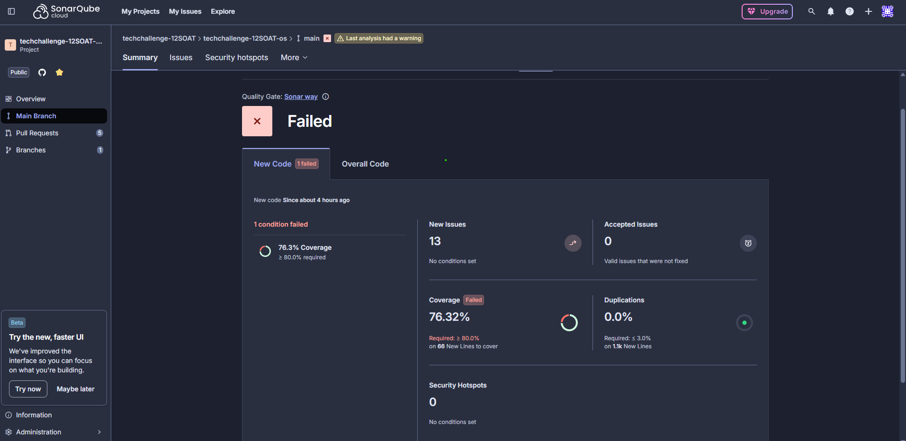

# POS TECH - Tech Challenge: Microsserviço de Ordem de Serviço

Este repositório contém o código-fonte e os manifestos de deploy do **Microsserviço de Ordem de Serviço**, componente central do **Sistema Integrado de Atendimento e Execução de Serviços** de uma oficina mecânica. O projeto foi desenvolvido como parte do "Tech Challenge" da pós-graduação POS TECH, com o foco em gerenciar todo o ciclo de vida das manutenções veiculares.

O sistema foi modelado utilizando a metodologia **Clean Architecture**, garantindo uma estrutura altamente testável, desacoplada e de fácil manutenção. A aplicação é um microsserviço desenvolvido em **Java 21** e **Spring Boot 3**, expondo APIs **RESTful** e utilizando mensageria para integração com outros componentes do ecossistema.

O foco deste repositório é a lógica de negócio das Ordens de Serviço (OS), abrangendo desde o cadastro de clientes e veículos até a atribuição de funcionários e o registro de serviços e itens de estoque utilizados.

### Tecnologias e Recursos da AWS

*   **Java 21 & Spring Boot 3:** Base robusta para o desenvolvimento da aplicação.
*   **PostgreSQL:** Banco de dados relacional para persistência de dados, com gestão de schema via **Liquibase**.
*   **AWS SQS:** Utilizado para comunicação assíncrona e processamento de notificações e eventos de domínio.
*   **AWS Secrets Manager:** Gerenciamento seguro de credenciais sensíveis (banco de dados, chaves de API).
*   **AWS ECR:** Registro de imagens Docker para versionamento e distribuição.
*   **Kubernetes (EKS):** Orquestração dos containers (Deployment, Service, HPA para escalabilidade automática).
*   **Spring Mail & Thymeleaf:** Sistema de notificação por e-mail com templates dinâmicos para acompanhamento de serviços.

### Swagger
A documentação completa da API de Ordem de Serviço está disponível via Swagger, facilitando o consumo e testes dos endpoints de Clientes, Veículos, Funcionários e Ordens de Serviço. Para acessar:

http://localhost:8080/swagger-ui/index.html

### Evidência do SonarCloud funcionando

